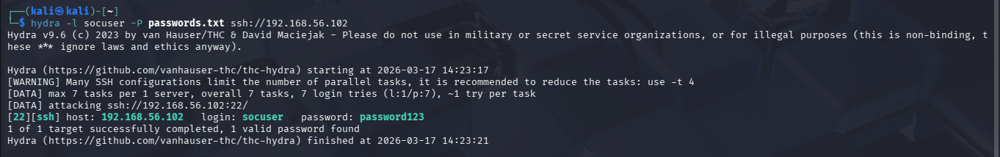
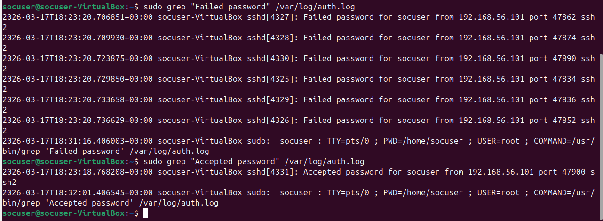
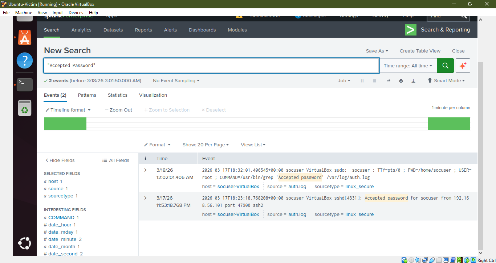
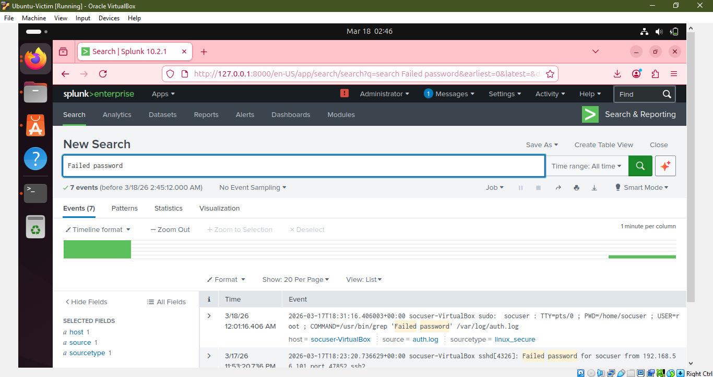
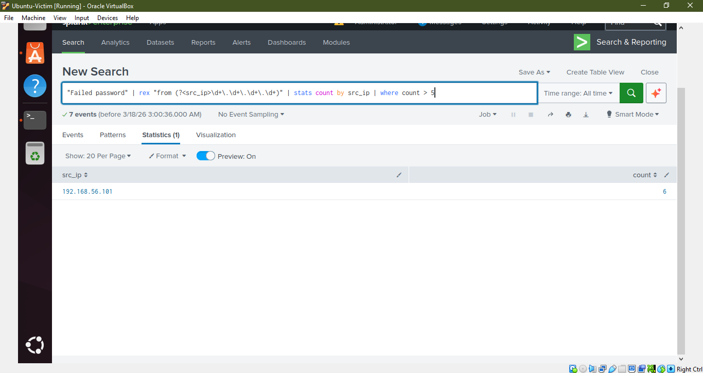
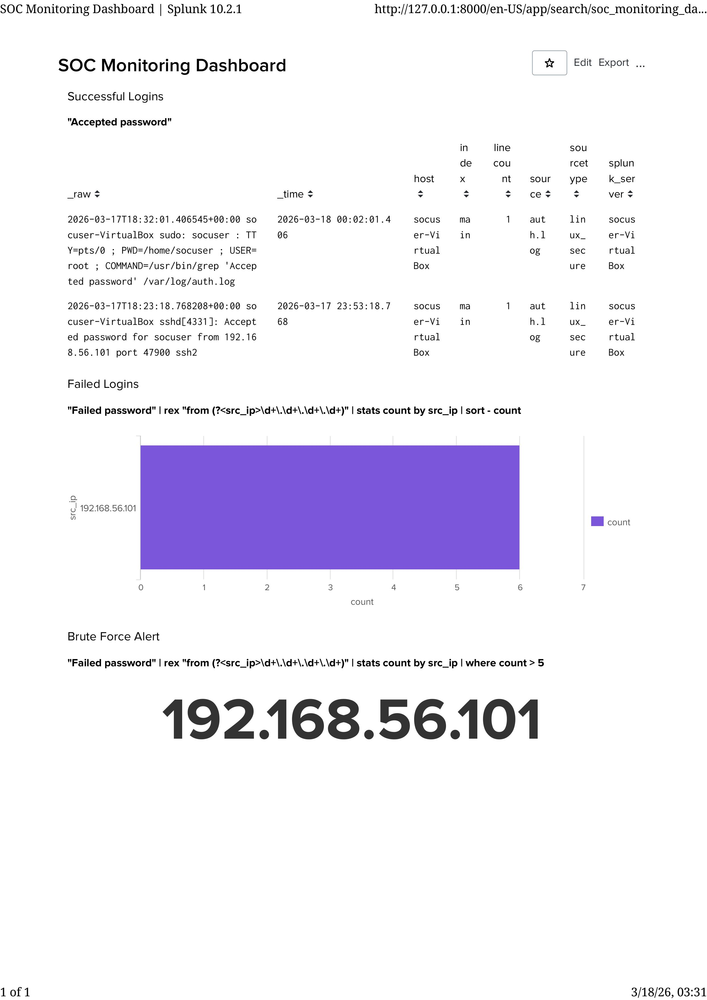

# 🔐 SOC Lab: SSH Brute Force Attack Detection using Splunk

## 📌 Overview

This project demonstrates a real-world Security Operations Center (SOC) scenario where an SSH brute force attack is simulated and detected using Splunk SIEM.

The lab includes attack simulation, log analysis, and detection using SPL queries and dashboards.

---

## 🛠️ Tools & Technologies

* Splunk SIEM
* Kali Linux
* Ubuntu Server
* Hydra (Brute force tool)
* Nmap
* Linux Authentication Logs (`auth.log`)

---

## ⚙️ Lab Architecture

* Attacker Machine: Kali Linux
* Victim Machine: Ubuntu Server
* SIEM Tool: Splunk Enterprise

---

## 🚨 Attack Simulation

* Performed SSH brute force attack using Hydra from Kali Linux
* Targeted Ubuntu server SSH service (port 22)
* Used password wordlist to attempt multiple logins

---

## 📊 Log Analysis

* Collected logs from `/var/log/auth.log`
* Identified:

  * Failed login attempts
  * Successful login events
* Extracted attacker IP from logs

---

## 🔍 Detection Queries (Splunk SPL)

### 1. Failed Login Detection

```
"Failed password"
| rex "from (?<src_ip>\d+\.\d+\.\d+\.\d+)"
| stats count by src_ip
| sort - count
```

---

### 2. Brute Force Detection

```
"Failed password"
| rex "from (?<src_ip>\d+\.\d+\.\d+\.\d+)"
| stats count by src_ip
| where count > 5
```

---

### 3. Successful Login Detection

```
"Accepted password"
```

---

## 📈 Dashboard

Created a Splunk dashboard to visualize:

* Failed login attempts
* Successful logins
* Brute force alerts

---

## 🧠 Key Findings

* Attacker IP: **192.168.56.101**
* Multiple failed login attempts detected
* Successful login confirmed after brute force attack
* Indicates account compromise

---

## 🎯 Conclusion

This project demonstrates how brute force attacks can be detected using SIEM tools by analyzing authentication logs and correlating failed and successful login attempts.

---

## 📸 Screenshots
Hydra Attack

Log Evidence (Ubuntu Victim)

Successful Login

Splunk Logs

Detection Query

SOC Dashboard


